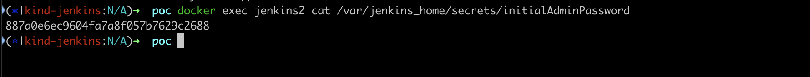
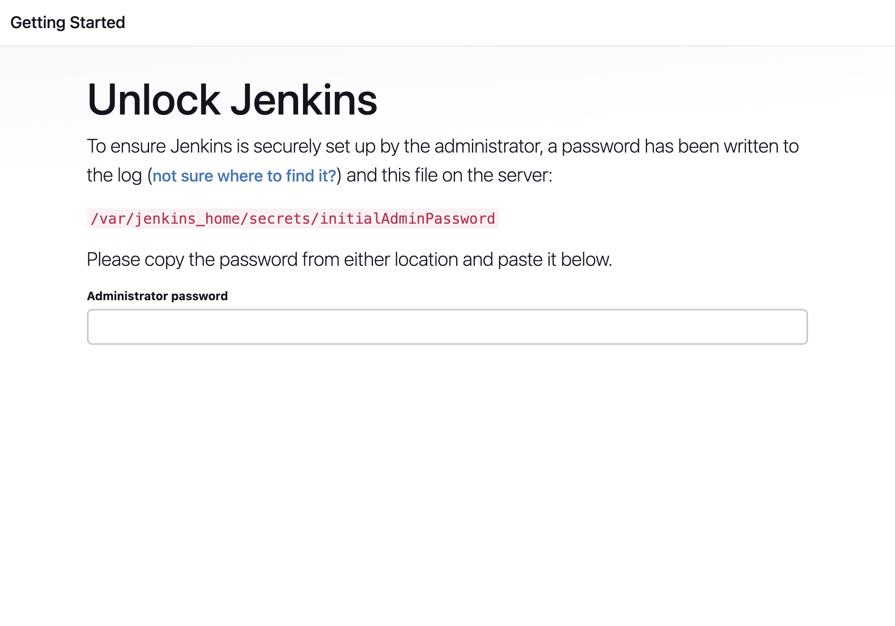
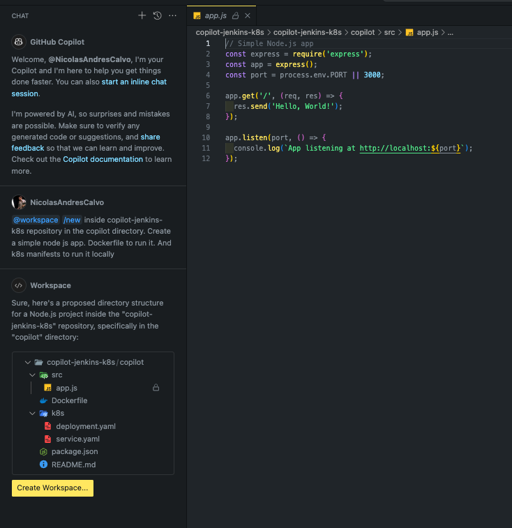
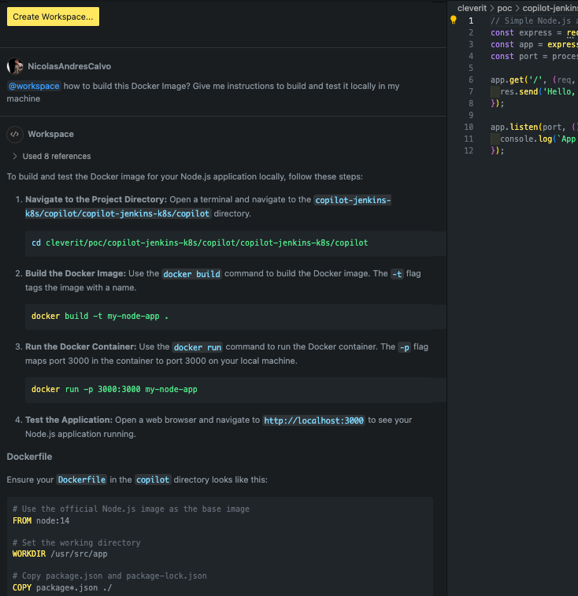
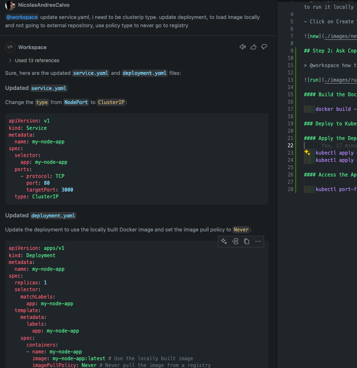

## Prerequisites

Before running the application, ensure you have the following installed on your machine:

- [Docker](https://www.docker.com/products/docker-desktop)
- [Kind](https://kind.sigs.k8s.io/) (Kubernetes in Docker)
- [kubectl](https://kubernetes.io/docs/tasks/tools/install-kubectl/) (Kubernetes command-line tool)
- [Jenkins](https://hub.docker.com/repository/docker/nicolasandrescalvo/jenkins/general)

#### Pull Docker Image

    docker pull nicolasandrescalvo/jenkins:v1.0

#### Run Jenkins Locally

    docker run -d --name jenkins \
      -p 8080:8080 \
      -p 50000:50000 \
      -v $(pwd)/jenkins_home:/var/jenkins_home \
      --privileged \
      -v /var/run/docker.sock:/var/run/docker.sock \
      nicolasandrescalvo/jenkins:v1.0

#### Extract Admin Secret

    docker exec jenkins cat /var/jenkins_home/secrets/initialAdminPassword

## Steps

### Step 1: Ask Copilot Chat to generate the workspace:

> @workspace /new inside copilot-jenkins-k8s repository in the copilot directory. Create a simple node js app. Dockerfile to run it. And k8s manifests to run it locally

- Click on Create Workspace.

### Step 2: Ask Copilot Chat how to run this app locally:

> @workspace how to build this Docker Image? Give me instructions to build and test it locally in my machine

#### Build the Docker Image:

    docker build -t my-node-app .

### Deploy to Kubernetes

#### Apply the Deployment and Service:

    kubectl apply -f k8s/deployment.yaml
    kubectl apply -f k8s/service.yaml

#### Access the Application:

    kubectl port-forward service/my-node-app 8080:80

### Step 3: Ask Copilot Chat how to update k8s manifest:

> @workspace update service.yaml, i need to be clusterip type. update deployment, to load image locally and not going to external repository, use policy type to never go to registry

